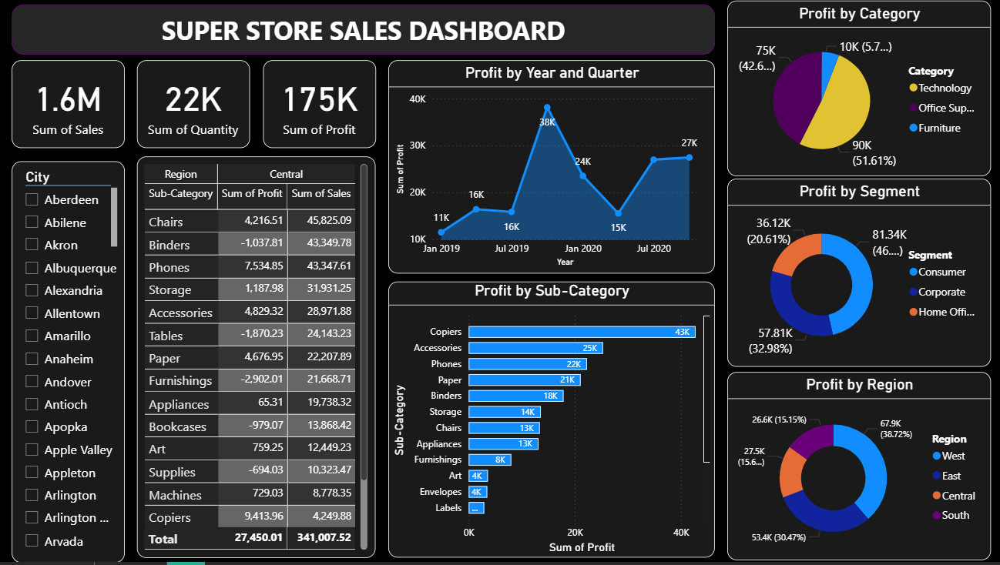

# Super Store Sales Dashboard

## Overview
This project is an interactive Power BI dashboard created to analyze Super Store sales performance, profitability, customer segments, and regional trends.

## Dashboard Features
- KPI Metrics (Sales, Quantity, Profit)
- Profit Analysis by Region
- Profit by Category
- Segment-wise Analysis
- Quarterly Profit Trends
- Sub-Category Performance
- Interactive City Filter

## Tools Used
- Power BI
- Data Visualization
- Business Analytics

## Dashboard Preview

## Key Insights
- Technology category generated highest profit
- West region contributed maximum profit
- Consumer segment showed strongest performance
- Copiers and Accessories were top profitable sub-categories

## Author
Aman Semwal
